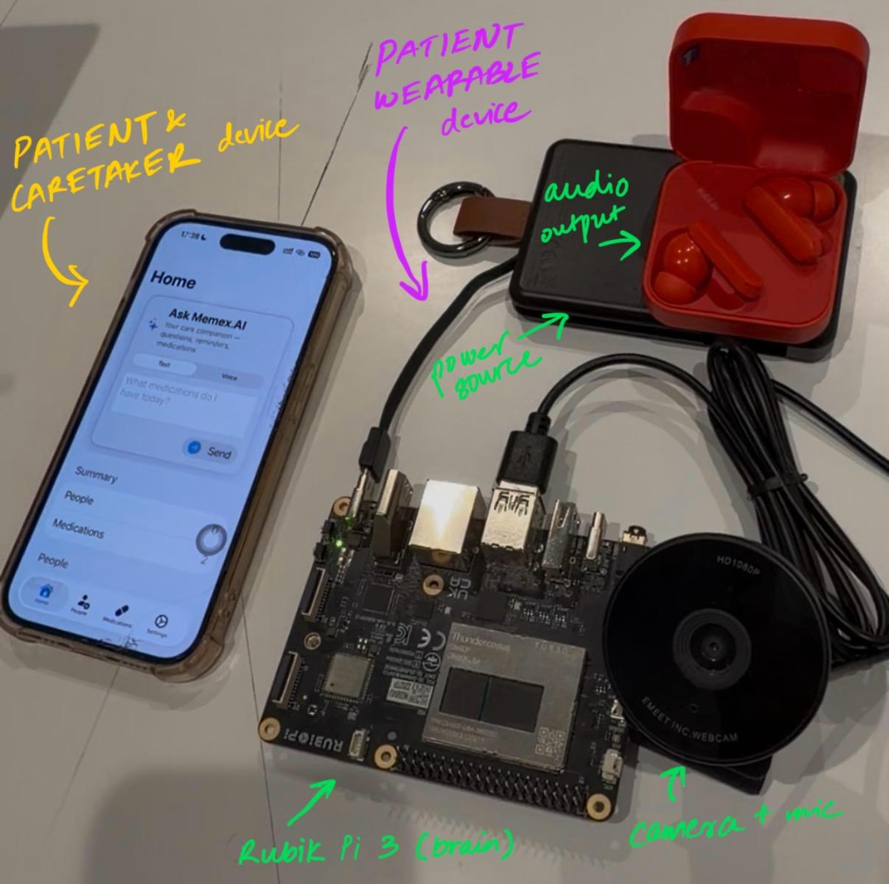

<div align="center">



# 🧠 Memex.AI

### A privacy-first memory companion for people who need one most.

*Faces, medications, and speech stay on the device. The agent can reason with GPT-4.1 or a local Granite model.*

[](#)
[](#)
[](#)
[](#)

---

</div>

Dementia. Alzheimer's. Age-related memory loss. These aren't statistics to the people who live them — or to the families who watch someone they love struggle to remember a face, a name, a medication they've taken every day for twenty years.

**Memex.AI** is an always-on, edge-deployed AI companion that runs on a [Rubik Pi 3](https://www.qualcomm.com/) (or any ARM64 device) and quietly does three things: **recognizes faces**, **manages medications**, and **answers questions** through natural voice conversation.

A native **iOS companion app** (MemoryMate) gives caregivers a clean interface to enroll faces, manage prescriptions via camera-based OCR, and talk to the device — all from their phone.

> **Privacy isn't a feature. It's the entire point.**
> Face photos, embeddings, medication schedules, and reminder history stay in MongoDB on the device. Speech-to-text and speech output run locally. Only the agent's written question and tool results leave the home, and only when you choose **GPT-4.1**. Switch the agent to **local Granite** and that reasoning stays on the device too.

---

## ✨ Features

<table>
<tr>
<td width="50%">

### 🖥️ Edge Device (Rubik Pi 3)

- **👤 Face Recognition** — The USB camera identifies enrolled faces and speaks the person's name and relation aloud using InsightFace (buffalo_l, 512-dim embeddings)
- **💊 Medication Reminders** — Time-based spoken reminders via APScheduler with cron triggers
- **🎙️ Voice Agent** — Wake phrase ("Hey Buddy"), then local Whisper speech-to-text → MCP agent → Piper text-to-speech
- **🗣️ Local TTS** — Piper neural voice, played through PipeWire (`pw-play`) or `aplay`, queued in Redis so the camera loop never waits on audio
- **🤖 Switchable MCP Agent** — Tool-calling agent that runs on **OpenAI GPT-4.1** or a **local Granite** model. Same tools either way: reminders, medications, and the current time

</td>
<td width="50%">

### 📱 iOS App (MemoryMate)

- **📸 Face Enrollment** — Photograph and register family members with name and relation directly from the phone
- **📋 Prescription OCR** — Photograph a prescription; Apple Vision OCR extracts text, then on-device Gemma 4 (Zetic Melange) structures it into medication JSON
- **💬 Voice & Text Assistant** — Talk to or text the Memex.AI agent from Home. Voice mode uses on-device speech recognition and plays the spoken reply from `/agent-voice`
- **📊 Dashboard** — Summary of enrolled people, active medications, and the AI assistant
- **⚙️ Settings** — Set the Pi's address (local IP or Tailscale) for network communication

</td>
</tr>
</table>

---

## 🏗️ Architecture

Memex.AI is a **multi-process system** on the edge device, paired with a native iOS app that communicates over the local network.

```
┌────────────────────────────────────────────────────────────────────┐
│                        RUBIK PI 3 (Edge)                          │
│                                                                    │
│  ┌──────────────────┐     HTTP      ┌──────────────────┐          │
│  │   active_mode.py │ ──────────── ▶│     main.py      │          │
│  │  (Orchestrator)  │               │  (FastAPI + ML)  │          │
│  │                  │               │                  │          │
│  │  Thread 1:       │               │  • InsightFace   │          │
│  │  📷 Camera loop  │               │  • /enroll-face  │          │
│  │  Thread 2:       │               │  • /medications  │          │
│  │  💊 Med scheduler│               │  • /agent        │          │
│  └────────┬─────────┘               │  • /agent-voice  │          │
│           │ rpush                   │  • /health       │          │
│           ▼                         └────────▲─────────┘          │
│  ┌──────────────────┐                        │ HTTP               │
│  │   Redis Queue    │               ┌────────┴─────────┐          │
│  │ memorymate:tts   │               │   iOS App        │          │
│  └────────┬─────────┘               │  (MemoryMate)    │          │
│           │ blpop                   │                  │          │
│           ▼                         │  📸 Face Enroll  │          │
│  ┌──────────────────┐               │  📋 Rx OCR       │          │
│  │   tts_worker.py  │               │  💬 Voice Agent  │          │
│  │  Piper + PipeWire│               └──────────────────┘          │
│  └──────────────────┘                                             │
│                                     ┌──────────────────┐          │
│  ┌──────────────────┐    stdio      │ mcp_agent_server │          │
│  │ voice_agent_thrd │ ──────────── ▶│  (MCP Tools)     │          │
│  │  Wake phrase     │               │  • set_reminder  │          │
│  │  → local Whisper │               │  • get_reminders │          │
│  │  → GPT-4.1       │               │  • medications   │          │
│  │    or Granite    │               │  • datetime      │          │
│  └──────────────────┘               └──────────────────┘          │
│                                                                    │
│                                     ┌──────────────────┐          │
│                                     │    MongoDB       │          │
│                                     │   localhost:27017│          │
│                                     │  • faces         │          │
│                                     │  • reminders     │          │
│                                     │  • medications   │          │
│                                     └──────────────────┘          │
└────────────────────────────────────────────────────────────────────┘
```

### Key Design Decisions

| Decision | Rationale |
|:---|:---|
| **Face ML stays on the device** | InsightFace runs on the Pi. Photos and embeddings are stored locally and are not sent to the agent model. |
| **API-first architecture** | `active_mode.py` is thin — all heavy inference lives in `main.py`, so one InsightFace instance is shared across requests. |
| **Redis TTS queue** | `speak()` is non-blocking. The camera loop does not stall while Piper generates and plays audio. |
| **MCP for agent tools** | The language model reasons; the MCP server reads and writes MongoDB. New tools do not require a new agent loop. |
| **GPT-4.1 or local Granite** | `AGENT_BACKEND` selects the reasoning model. Tools, prompts, and the iOS API stay the same. |
| **MJPEG camera codec** | Raw YUYV saturates the Pi's USB bus. MJPEG compresses in hardware, about 10× less bandwidth. |
| **Vision OCR + Gemma 4 (iOS)** | Prescription text is extracted on the iPhone with Apple Vision, then structured into JSON by on-device Gemma 4. No cloud round-trip for that step. |

---

## 📁 Project Structure

```
EverCare/
│
├── MemexAI_Devices.jpg               # Hardware photo used above
├── rubic_pi_3/                       # ── Edge Device Backend ──
│   ├── main.py                       # FastAPI server: face ML, REST API, agent endpoint
│   ├── active_mode.py                # Orchestrator: camera loop + medication scheduler
│   ├── tts_worker.py                 # Dedicated TTS process (Redis → Piper)
│   ├── voice_agent_thread.py         # Wake phrase → Whisper → MCP agent → TTS
│   ├── mcp_agent_client.py           # Agent client (GPT-4.1 or local Granite)
│   ├── mcp_agent_server.py           # MCP tool server (reminders, medications, datetime)
│   ├── face_helpers.py               # Cosine similarity matching for face embeddings
│   ├── config.py                     # Central config: models, URLs, queue names
│   ├── requirements.txt              # Python dependencies
│   ├── .env.template                 # Environment variable template
│   ├── start_memorymate.sh           # Optional launcher for API, TTS, and camera
│   └── data/faces/                   # Enrolled face images (local only, gitignored)
│
├── ios/                              # ── iOS Companion App ──
│   ├── Configuration/
│   │   ├── Secrets.example.xcconfig  # API key template (copy to Secrets.xcconfig)
│   │   └── MemoryMateSecretsMerge.plist
│   ├── MemoryMate/
│   │   ├── App/                      # SwiftUI app entry, tabs, error state
│   │   ├── Models/                   # Person, Medication, APIError, AgentAPI
│   │   ├── Services/
│   │   │   ├── APIService.swift      # HTTP client for the Pi
│   │   │   ├── OCRService.swift      # Apple Vision text recognition
│   │   │   ├── GemmaMedicationStructuringService.swift
│   │   │   ├── MelangeLLMGenerationService.swift
│   │   │   ├── PrescriptionPhotoMelangePipeline.swift
│   │   │   ├── VoiceQueryRecorder.swift
│   │   │   └── MelangeConfiguration.swift
│   │   ├── ViewModels/               # Medication, face enrollment, settings
│   │   └── Views/
│   │       ├── Dashboard/            # Home, people, medications, assistant
│   │       ├── Enrollment/           # Face capture and confirmation
│   │       ├── Medication/           # Prescription camera, manual entry, review
│   │       └── Settings/             # Pi address
│   └── MemoryMate.xcodeproj/
│
└── README.md                         # ← You are here
```

---

## 🚀 Getting Started

### Edge Device Setup (Rubik Pi 3)

#### Prerequisites

| Requirement | Details |
|:---|:---|
| **Hardware** | Rubik Pi 3 / Raspberry Pi / any ARM64 device |
| **OS** | Ubuntu 22.04+ |
| **Python** | 3.10+ |
| **Database** | MongoDB 8.0 |
| **Queue** | Redis |
| **Camera** | USB camera with a microphone (`/dev/video0`) |
| **Audio** | PipeWire or ALSA output — paired earbuds or a speaker |

#### 1. Install System Dependencies

```bash
sudo apt update
sudo apt install -y redis-server python3-venv pipewire-bin alsa-utils
sudo systemctl enable redis && sudo systemctl start redis
```

**MongoDB (ARM64):**
```bash
curl -fsSL https://www.mongodb.org/static/pgp/server-8.0.asc | \
  sudo gpg -o /usr/share/keyrings/mongodb-server-8.0.gpg --dearmor

echo "deb [ arch=amd64,arm64 signed-by=/usr/share/keyrings/mongodb-server-8.0.gpg ] \
  https://repo.mongodb.org/apt/ubuntu noble/mongodb-org/8.0 multiverse" | \
  sudo tee /etc/apt/sources.list.d/mongodb-org-8.0.list

sudo apt update && sudo apt install -y mongodb-org
sudo systemctl enable mongod && sudo systemctl start mongod
```

#### 2. Python Environment

```bash
git clone https://github.com/Pennyv99/EverCare.git
cd EverCare/rubic_pi_3

python3 -m venv venv
source venv/bin/activate
pip install -r requirements.txt
python3 -m piper.download_voices --data-dir data/voices en_US-lessac-medium
```

#### 3. Environment Variables

```bash
cp .env.template .env
```

Choose the agent model in `.env`:

```bash
# Cloud reasoning
AGENT_BACKEND=openai
OPENAI_API_KEY=sk-...
OPENAI_MODEL=gpt-4.1

# Or fully local reasoning (OpenAI-compatible server such as Ollama)
AGENT_BACKEND=granite
GRANITE_BASE_URL=http://127.0.0.1:11434/v1
GRANITE_MODEL=granite3.3
```

Local speech defaults are already in the template: Whisper `tiny`, wake phrase `hey buddy`, and the Piper voice at `data/voices/en_US-lessac-medium.onnx`.

#### 4. Run All Services

Open **4 terminals** (or use `tmux`):

```bash
# Terminal 1 — FastAPI + InsightFace
source venv/bin/activate && python3 main.py

# Terminal 2 — TTS Worker (Redis → speaker)
source venv/bin/activate && python3 tts_worker.py

# Terminal 3 — Camera + Medication Scheduler
source venv/bin/activate && python3 active_mode.py

# Terminal 4 — Voice Agent (wake phrase → Whisper → agent → TTS)
source venv/bin/activate && python3 voice_agent_thread.py
```

`start_memorymate.sh` can launch the API, TTS worker, and camera loop together. Edit `project_dir` in that script so it points at this checkout. The voice agent is still started separately.

---

### iOS App Setup (MemoryMate)

#### Prerequisites

| Requirement | Details |
|:---|:---|
| **Xcode** | Current Xcode that can build the iOS 26.4 deployment target |
| **iOS** | 26.4+ |
| **Swift** | 5 |
| **Melange Key** | From the [Zetic AI Dashboard](https://zetic.ai), used for on-device Gemma 4 |

#### 1. Configure Secrets

```bash
cd ios/Configuration
cp Secrets.example.xcconfig Secrets.xcconfig
# Edit Secrets.xcconfig:
#   MELANGE_PERSONAL_KEY = your_key_here
```

`Secrets.xcconfig` is gitignored.

#### 2. Build & Run

1. Open `ios/MemoryMate.xcodeproj` in Xcode
2. Select your target device or simulator
3. Build and run (⌘R)
4. In the **Settings** tab, enter the Pi's address

#### 3. Connect to the Pi

The iOS app talks to the Pi over HTTP on port `8000`. Keep both devices on the same network, or connect them with [Tailscale](https://tailscale.com/) and paste that address into Settings.

---

## 📡 REST API Reference

All endpoints are served by `main.py` on port **8000**.

### Health & Status

| Method | Endpoint | Description |
|:---|:---|:---|
| `GET` | `/health` | System health: camera, mic, and speaker status |

### Face Management

| Method | Endpoint | Description |
|:---|:---|:---|
| `POST` | `/enroll-face` | Enroll a person with name, relation, and JPEG photos |
| `GET` | `/enrolled-faces` | List enrolled people, including base64 image data |
| `DELETE` | `/face/{id}` | Remove an enrolled person and their images |
| `POST` | `/recognize-face` | Match an uploaded photo against enrolled faces |

### Medications

| Method | Endpoint | Description |
|:---|:---|:---|
| `POST` | `/add-medication` | Add a medication schedule (drug, dose, times, condition) |
| `GET` | `/medications` | List scheduled medications |
| `DELETE` | `/medication/{id}` | Remove a medication |

### Reminders

| Method | Endpoint | Description |
|:---|:---|:---|
| `GET` | `/reminders` | Get active reminders |
| `DELETE` | `/reminders/reset` | Clear all reminders |

### Agent

| Method | Endpoint | Description |
|:---|:---|:---|
| `POST` | `/agent` | Send a natural language query; receive a text answer |
| `POST` | `/agent-voice` | Send a query and receive a spoken audio reply for the iOS app |

### Internal APIs

Used by `active_mode.py`. They are not part of the caregiver UI.

| Method | Endpoint | Description |
|:---|:---|:---|
| `POST` | `/internal/extract-embedding` | Extract a 512-dim face embedding from an image path |
| `POST` | `/internal/match-embedding` | Match an embedding against enrolled faces |

<details>
<summary><strong>Example: Enroll a Face</strong></summary>

```bash
curl -X POST http://<device-ip>:8000/enroll-face \
  -F "name=Sarah" \
  -F "relation=daughter" \
  -F "images=@sarah1.jpg" \
  -F "images=@sarah2.jpg" \
  -F "images=@sarah3.jpg"
```

Multiple photos improve recognition across lighting and angles.
</details>

<details>
<summary><strong>Example: Agent Query</strong></summary>

```bash
curl -X POST http://<device-ip>:8000/agent \
  -H "Content-Type: application/json" \
  -d '{"query": "What reminders do I have today?"}'

# Response:
{
  "query": "What reminders do I have today?",
  "response": "You have 2 reminders: Call the doctor at 3:00 PM...",
  "status": "success"
}
```
</details>

---

## 🛠️ Voice Agent Tools (MCP)

The MCP server exposes these tools to whichever model is selected:

| Tool | Parameters | Description |
|:---|:---|:---|
| `get_current_datetime()` | — | Current date, time, and day of week |
| `set_reminder(title, time_str)` | title, time | Set a reminder. Accepts "3 pm" and "in 20 minutes" |
| `get_all_reminders()` | — | Active reminders, sorted by time |
| `get_latest_reminders(count)` | count (1–10) | Most recently created reminders |
| `add_medication(drug, dose, times, condition)` | drug, dose, times, condition | Schedule a medication |
| `get_all_medications()` | — | Every scheduled medication |
| `get_latest_medication()` | — | Next upcoming dose, based on the current time |

---

## 🤖 LLM Backend

The edge agent uses one reasoning backend at a time. Switch it with `AGENT_BACKEND` in `rubic_pi_3/.env`, then restart `main.py` and `voice_agent_thread.py`.

| Mode | What it does |
|:---|:---|
| **`openai`** (default) | **GPT-4.1** through the OpenAI API. Set `OPENAI_API_KEY` and, if you want a different snapshot, `OPENAI_MODEL`. The text question and MCP tool results are sent to OpenAI. Face images and embeddings are not. |
| **`granite`** | A **local Granite** model behind an OpenAI-compatible chat API (Ollama, vLLM, or llama.cpp). Set `GRANITE_BASE_URL` (default `http://127.0.0.1:11434/v1`) and `GRANITE_MODEL` (default `granite3.3`). Reasoning stays on the machine that hosts Granite. The model needs to support tool calling. |

```bash
# GPT-4.1
AGENT_BACKEND=openai
OPENAI_MODEL=gpt-4.1

# Local Granite
AGENT_BACKEND=granite
GRANITE_MODEL=granite3.3
```

Both modes call the same MCP tools and return the same `/agent` and `/agent-voice` responses.

The iOS app uses **Zetic Melange** to run **Gemma 4** on the phone for prescription structuring. That step does not use GPT-4.1 or Granite, and it does not need a network connection.

Speech on the Pi is also local in both modes: **Whisper tiny** for the wake phrase and the follow-up utterance, and **Piper** for spoken replies.

---

## 🔒 Why Local-First Matters

This is built for people who have already lost some of their independence. Their face, their routine, and their family should stay in the home.

| Principle | What It Means |
|:---|:---|
| 🔐 **Biometrics stay home** | Face embeddings, medication schedules, and reminder history live in MongoDB on the device |
| 📶 **Core help works offline** | The camera still recognizes people, medication reminders still fire, and Piper still speaks. Granite mode keeps agent answers local too |
| ☁️ **Cloud is optional** | GPT-4.1 is a switch, not a requirement. Choose it when you want that model; choose Granite when the question should not leave the device |
| ⚡ **Low latency for faces** | Recognition runs on the Pi, with no server round-trip for the photo |
| 📱 **On-device iOS ML** | Prescription OCR and structuring happen on the iPhone |

---

## 🗺️ Roadmap

- [x] On-device Whisper for speech-to-text on the Pi
- [x] iOS companion for face enrollment, prescriptions, and the assistant
- [x] Switchable agent: GPT-4.1 or local Granite
- [ ] Dedicated wake-word engine (the current loop listens for the phrase "hey buddy" with Whisper)
- [ ] Emotion detection — recognize distress and alert a caregiver
- [ ] Caregiver web dashboard for remote monitoring
- [ ] Multi-language voice support
- [ ] Medication interaction warnings

---

## 🤝 Contributing

This project is personal in origin and open in spirit. If you work in elder care, assistive technology, or just understand why this matters — pull requests, issues, and ideas are welcome.

```bash
# Fork the repo, then:
git clone https://github.com/Pennyv99/EverCare.git
cd EverCare
git checkout -b feature/your-feature
# Make changes, commit, push, and open a PR
```

---

<div align="center">

*Built with care. For people who deserve better than forgetting.*

**[Edge Backend](rubic_pi_3/) · [iOS App](ios/) · [API Docs](#-rest-api-reference)**

</div>
